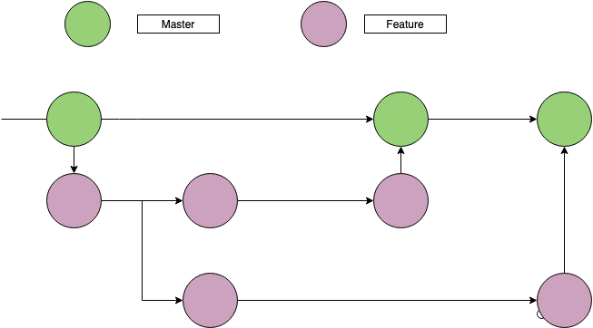

# SynchIT-documentation
Documentation repository for MERN project SynchIT by Carly Davis and Maria Gorin

## Description of your website, including:

### Purpose

### Functionality / features

### Target audience

### Tech stack

- MERN stack

SynchIT is being developed using MERN stack ,a JavaScript framework which includes 4 technologies:

_Mongo DB_ is used for organizing data

_Node.js_ and Express.js are used to create a server side of the app

_React.js_ is used to build client side of the app

- CSS is used for styling 

- Netlify is a deployment platform we chose for the client side of the app

- Heroku was used to deploy server

## Dataflow Diagram

## Application Architecture Diagram

## User stories

[User stories board](https://app.cardboardit.com/maps/135109#)

## Wireframes for multiple standard screen sizes, created using industry standard software

## Project management model and source control

### Source control

We use Gitflow for source control of the application and store our work in GitHub repositories.

We created separate repositories for the server app and a client app.

Master branches contain stable version of the code which get deployed.

Feature branches contain work in progress.

## Screenshots of your Trello board demonstrating use throughout the initial stages of the project
