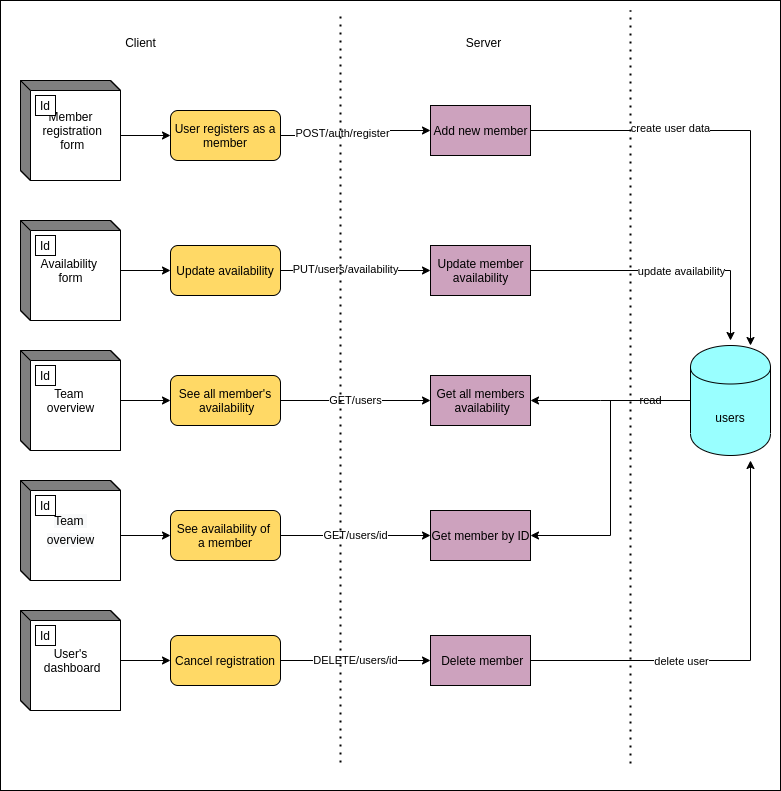
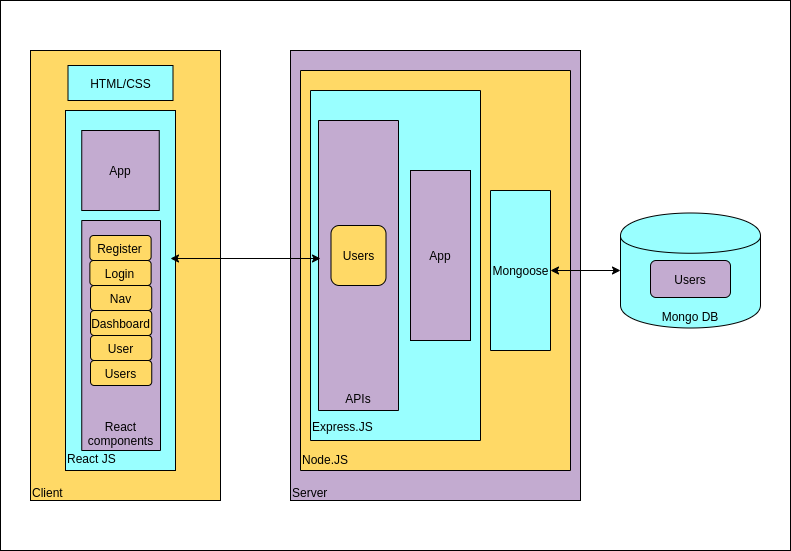
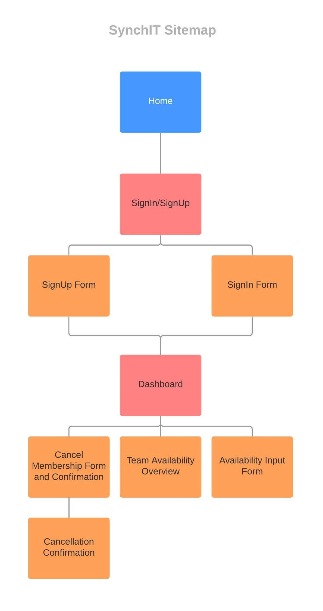

# SynchIT
Documentation repository for MERN project SynchIT by Carly Davis and Maria Gorin

## Description of your website, including:

### Purpose

SynchIt is a scheduling helper web app that’s primary purpose is to make it easier for people to connect.

The purpose of SynchIT is to help teams of people synchronise their lifestyles, and make it easier to schedule meetings, catch up for brunch, and much more.

### Functionality / features

SynchIT works by having the user register as a team along with others, and then entering their availability into a calendar. It then takes all the user input and compares it against the rest of the data collected from the team, and displays it for everyone to see using a colour coded system - Green meaning ‘most’, if not ‘all’ users in a cohort are available, Yellow meaning some people are available, and Red meaning not many, and maybe even no one is available.

### Target audience

Whether it’s a group of friends or a team of work colleagues in a major company, SynchIT helps everyone see their acquaintances availability and schedules to help make catching up or setting meetings a breeze.

It's made for people who wish to make it easier to stay connected in an environment where the current climate is making it hard for people to do that.

### Tech stack

- MERN stack

SynchIT is being developed using MERN stack ,a JavaScript framework which includes 4 technologies:

_Mongo DB_ is used for organizing data

_Node.js_ and Express.js are used to create a server side of the app

_React.js_ is used to build client side of the app

- CSS is used for styling 

- Netlify is a deployment platform we chose for the client side of the app

- Heroku was used to deploy server

## Dataflow Diagram

## Application Architecture Diagram

## User stories

[User stories board](https://app.cardboardit.com/maps/135109#)

## Wireframes for multiple standard screen sizes, created using industry standard software

## Project management model and source control

### Source control

We use Gitflow for source control of the application and store our work in GitHub repositories.

We created separate repositories for the server app and a client app.

Master branches contain stable version of the code which get deployed.

Feature branches contain work in progress.

## Screenshots of your Trello board demonstrating use throughout the initial stages of the project
